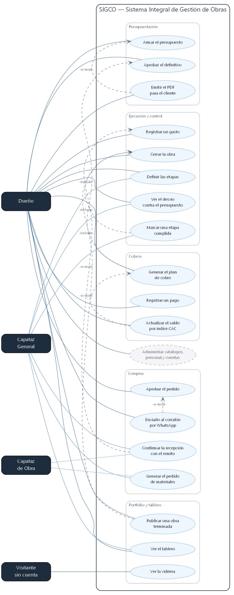
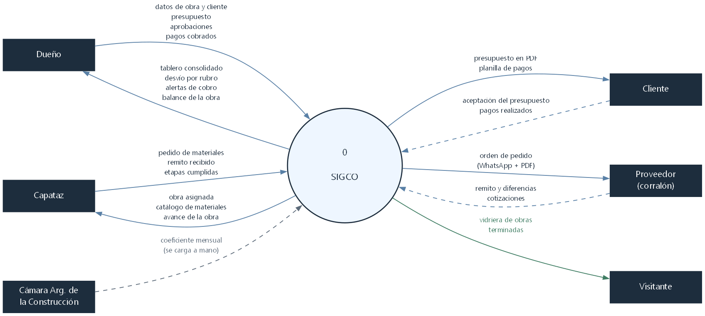
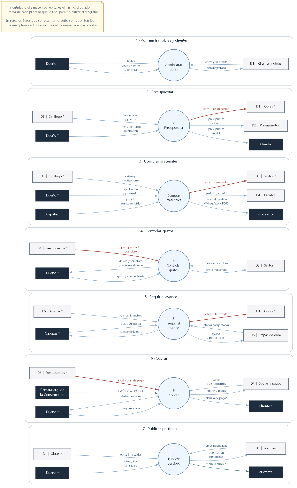
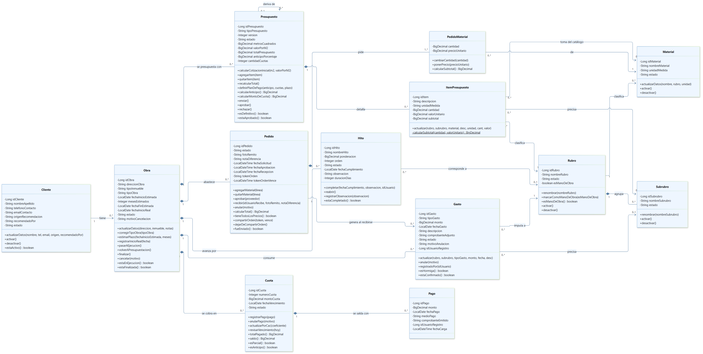
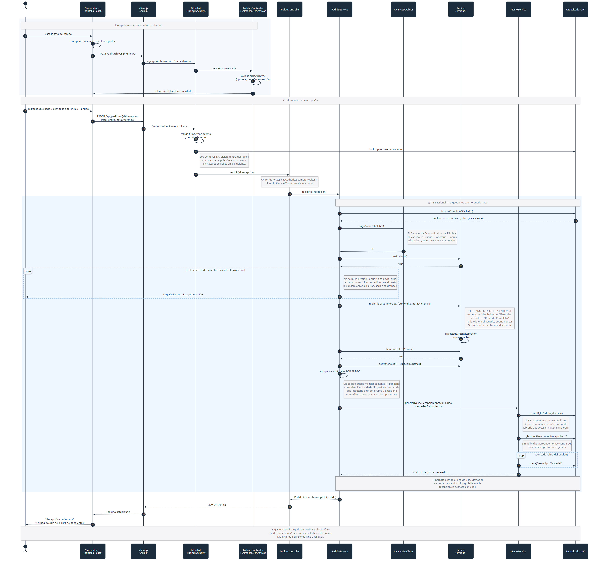

# Diagramas del sistema

> Los cuatro diagramas que pidió la cátedra: casos de uso, flujo de datos,
> clases y secuencia.
>
> **No están dibujados desde el informe: están sacados del sistema construido.**
> Los actores y sus permisos salen de la tabla `rol_permiso` y de los
> `@PreAuthorize` de cada controlador; las clases y sus operaciones son las
> firmas reales de las entidades JPA; la secuencia recorre el código de
> `PedidoService.recibir()` línea por línea. Si el código cambia, estos
> diagramas quedan desactualizados, y eso es a propósito: describen lo que hay,
> no lo que se planeó.
>
> Cada archivo fuente lleva adentro, en comentarios, el porqué de cada decisión
> de armado. Este documento es el resumen.

---

## Los archivos

| # | Diagrama | Fuente | Imagen |
| --- | --- | --- | --- |
| 1 | Casos de uso | [casos-de-uso.dot](casos-de-uso.dot) | [uml-01-casos-de-uso.png](img/uml-01-casos-de-uso.png) · [svg](img/uml-01-casos-de-uso.svg) |
| 2 | Flujo de datos — nivel 0 (contexto) | [dfd-nivel-0.dot](dfd-nivel-0.dot) | [uml-02-dfd-nivel-0.png](img/uml-02-dfd-nivel-0.png) · [svg](img/uml-02-dfd-nivel-0.svg) |
| 3 | Flujo de datos — nivel 1 | [dfd-nivel-1.dot](dfd-nivel-1.dot) | [uml-03-dfd-nivel-1.png](img/uml-03-dfd-nivel-1.png) · [svg](img/uml-03-dfd-nivel-1.svg) |
| 4 | Clases | [clases.mmd](clases.mmd) | [uml-04-clases.png](img/uml-04-clases.png) · [svg](img/uml-04-clases.svg) |
| 5 | Secuencia | [secuencia-recepcion.mmd](secuencia-recepcion.mmd) | [uml-05-secuencia-recepcion.png](img/uml-05-secuencia-recepcion.png) · [svg](img/uml-05-secuencia-recepcion.svg) |

Los `.dot` se dibujan con Graphviz y los `.mmd` con Mermaid. Cómo regenerarlos
está al final.

---

## 1. Diagrama de casos de uso



**Qué muestra:** quién puede hacer qué, y qué casos de uso arrastran a otros.

### Por qué no están los 28 casos de uso

La cátedra pidió centrarse en los procesos core y saltear los ABM ("obviemos
diagramar el proceso de alta de usuario, por ejemplo"). Por eso los seis módulos
de mantenimiento —clientes, materiales, proveedores, personal, usuarios y
accesos— entran como **un solo caso agrupado, con borde punteado**: existen, se
ven, y no ocupan el diagrama.

Además del pedido, hay un motivo práctico. Con los 28 casos de uso completos
ningún acomodamiento queda legible: se probó en columna (1037 × 3127 px) y
apaisado (4153 × 310 px), y o es una tira vertical o es una cinta horizontal.
Recortado a lo core, entra en una hoja.

### Los cuatro actores

Tres salen de la matriz de permisos del informe. **El cuarto es el visitante sin
cuenta**, que mira la vidriera del portfolio: es público por diseño, y dejarlo
afuera escondería que el sistema tiene una superficie abierta a internet.

La diferencia entre el Capataz General y el Capataz de Obra no es de permisos
sino de **alcance**: el segundo tiene los mismos casos de uso pero solo sobre la
obra que tiene asignada. Ese límite no lo da un permiso, lo resuelve
`AlcanceDeObras` siguiendo la cadena usuario → operario → obras asignadas en
cada petición.

### Las relaciones «include» y «extend»

Son las que muestran las reglas del circuito, no adornos:

| Relación | Qué regla representa |
| --- | --- |
| Generar el plan de cobro **«include»** Aprobar el definitivo | No hay plan de pago sin definitivo aprobado |
| Confirmar la recepción **«include»** Registrar un gasto | La recepción **siempre** genera el gasto. Es lo que elimina la doble carga |
| Marcar una etapa cumplida **«include»** Cerrar la obra | Al completar el último hito la obra pasa a Finalizada |
| Enviar por WhatsApp **«extend»** Aprobar el pedido | El pedido se puede mandar o no |
| Emitir el PDF **«extend»** Armar el presupuesto | Opcional |
| Actualizar por CAC **«extend»** Generar el plan de cobro | Solo si hay inflación que trasladar |
| Publicar en el portfolio **«extend»** Cerrar la obra | No toda obra terminada se publica |

**Ojo con la dirección**, que es la pregunta clásica en una defensa: «include»
apunta *del caso base al incluido* y pasa siempre; «extend» va *al revés*, desde
el caso que extiende hacia el base, y pasa a veces.

---

## 2 y 3. Diagramas de flujo de datos

Un DFD **no** es un diagrama de actividad: no muestra el orden en que pasan las
cosas, muestra **qué información se mueve y dónde queda guardada**. Por eso cada
flecha está etiquetada con el *dato* que viaja ("orden de pedido", "remito y
diferencias") y no con la acción.

Notación DeMarco/Yourdon, la misma en los dos niveles:

| Símbolo | Qué es |
| --- | --- |
| Rectángulo | Entidad externa — está afuera del sistema |
| Círculo numerado | Proceso |
| Caja `Dn` | Almacén de datos |

### Nivel 0 — el contexto



El sistema entero como un solo proceso. Responde una sola pregunta: **¿con quién
habla SIGCO y qué le manda a cada uno?**

Dos cosas que conviene poder explicar:

- **El cliente y el proveedor nunca entran al sistema.** Están igual, porque el
  dato cruza la frontera: reciben documentos que SIGCO emite (el PDF del
  presupuesto, la orden de pedido por WhatsApp) y devuelven información que
  alguien de adentro carga (la aceptación, el remito). Sus flechas van punteadas
  para marcarlo.
- **La Cámara Argentina de la Construcción es una entidad externa, no una
  integración.** El coeficiente CAC se carga a mano: la importación automática
  está explícitamente fuera del alcance de esta versión.

**No hay almacenes de datos en el nivel 0**, y es correcto: son internos al
proceso, y este nivel muestra justamente lo que se ve desde afuera.

### Nivel 1 — los siete procesos



Acá se abre el círculo `0` en los siete procesos del circuito y aparecen los
almacenes de datos, que se corresponden con las tablas reales.

**Las entidades y los almacenes aparecen repetidos, marcados con `*`.** Es la
convención estándar del DFD y acá era necesaria: el Dueño toca los siete
procesos, y con una sola caja el diagrama medía 5735 × 1360 px de flechas
cruzándose. Repetir la caja al lado de cada proceso es lo que lo vuelve legible.
Hay una leyenda en el diagrama que lo aclara.

**Los flujos rojos son los cruces entre circuitos**, y son la parte interesante:

- El presupuesto aprobado **pone la obra en ejecución** (proceso 2 → almacén de obras)
- La recepción del pedido **genera el gasto** (proceso 3 → almacén de gastos)
- El presupuesto **le da al control de gastos contra qué comparar**, rubro por rubro
- El último hito **da la obra por finalizada** (proceso 5 → almacén de obras)
- El total y el plan de pago del presupuesto **arman las cuotas** (→ proceso 6)

Son exactamente las integraciones que el relevamiento pedía y que hoy la empresa
hace a mano, retipeando de una planilla a otra.

---

## 4. Diagrama de clases



**Alcance:** las trece clases del circuito core, de las 29 entidades del sistema.
Quedan afuera los catálogos de apoyo (Proveedor, Cotización, Operario,
Portfolio) y la seguridad (Usuario, Rol, Permiso), con el mismo criterio con que
se recortó el diagrama de casos de uso.

### Lo que hay que mirar: no hay setters

Ninguna clase tiene `setEstado()`. Tienen **operaciones con nombre**:
`aprobar()`, `recibir()`, `anular()`, `completar()`, `pasarAEjecucion()`.

No es una cuestión de estilo. Es lo que impide que una regla de negocio se
saltee desde afuera: a una obra no se le asigna el estado "Finalizada", se le
pide que se finalice, y **la clase decide si puede**. Si existiera
`setEstado()`, cualquier servicio podría darla por terminada sin pasar por la
comprobación de los hitos.

Tres ejemplos de reglas que viven adentro de la entidad y no en un servicio:

| Operación | Qué decide sola |
| --- | --- |
| `Pedido.recibir(...)` | El estado final sale de **si vino o no una nota de diferencia**, no de lo que elija el usuario. Si lo eligiera él, podría marcar "Recibido Completo" y a la vez escribir una diferencia, y el pedido quedaría mintiendo |
| `Cuota.registrarPago(pago)` | El estado de la cuota se **deriva** de sus pagos: sin pagos Pendiente, con saldo Parcial, sin saldo Abonada. Así no puede existir una cuota "Abonada" con saldo |
| `ItemPresupuesto` | El subtotal **nunca se recibe de afuera**: se deriva siempre de cantidad × valor unitario. `calcularSubtotal()` es privado y estático, por eso va subrayado |

### La autorreferencia de Presupuesto

`Presupuesto → Presupuesto ("deriva de")` es el versionado real del módulo: el
presupuesto definitivo toma el anteproyecto como base **sin sobreescribirlo**.
Quedan los dos registros, vinculados por `id_presupuesto_base`. Es lo que
permite mostrarle al cliente en qué cambió el presupuesto respecto de lo que se
le había anticipado.

### Composición contra asociación

Las relaciones con rombo lleno (`*--`) marcan que **la parte no vive sin el
todo**: un ítem sin su presupuesto no significa nada, y al borrarse el
presupuesto se van con él. Las flechas simples son referencias: un gasto apunta
a un rubro, pero el rubro existe por su cuenta y se comparte entre todas las
obras.

---

## 5. Diagrama de secuencia



**Caso de uso: "Confirmar la recepción del pedido con el remito".**

### Por qué este caso y no otro

Es el único del sistema que **cruza dos módulos**: el capataz confirma en
Compras y el gasto aparece solo en Gastos. Ese cruce es la razón de ser del
relevamiento — hoy la empresa tipea el material dos veces, una al pedirlo por
WhatsApp y otra al cargarlo como gasto en la planilla del celular.

Y además recorre todas las capas: pantalla React → Axios → filtro JWT →
controlador → servicio → entidad → repositorio, con el almacenamiento de
archivos y el alcance por obra de por medio. Un caso más simple no mostraría ni
la mitad del sistema.

### Los cuatro momentos que conviene poder explicar

**1. La foto se sube antes, en una petición aparte.** El remito es un binario y
el resto de la recepción es JSON, así que viaja en su propio `POST /api/archivos`.
El backend valida el tipo real del archivo (no la extensión) y devuelve una
referencia. Eso es lo que después se guarda en `pedido.foto_remito`: **la base
nunca guarda la imagen, solo dónde está.**

**2. Los permisos no viajan dentro del token.** El filtro JWT valida la firma, el
vencimiento y la versión de sesión, y recién ahí **lee los permisos de la base**.
Es lo que hace que un cambio en el módulo Accesos se aplique en la petición
siguiente, sin esperar a que el usuario vuelva a entrar.

**3. El alcance se resuelve dentro del servicio, no en el controlador.**
`exigirAlcance(idObra)` es lo que hace cumplir el "(su obra)" de la matriz de
permisos. Va después de cargar el pedido porque hace falta saber a qué obra
pertenece para poder comprobarlo.

**4. Todo ocurre dentro de una sola transacción.** La recepción y la generación
del gasto están en el mismo `@Transactional`: si algo falla al generar el gasto,
la recepción tampoco queda registrada. **No puede existir un pedido recibido sin
su gasto**, que es precisamente el error que se quiere evitar.

### Dos decisiones que se ven en el medio

- **El gasto se agrupa por rubro, no es uno solo.** Un pedido puede mezclar
  cemento (Albañilería) con cable (Electricidad). Un gasto único habría que
  imputarlo a un solo rubro y ensuciaría el semáforo de desvío, que compara
  rubro por rubro.
- **Si el pedido no tiene todos los precios cargados, no se genera nada.** Un
  gasto con monto incompleto es peor que ninguno: el semáforo diría que la obra
  viene mejor de lo que viene.

---

## Cómo regenerar las imágenes

Graphviz para los `.dot` y Mermaid para los `.mmd`.

```bash
# Casos de uso y los dos DFD
dot -Tpng casos-de-uso.dot  -o img/uml-01-casos-de-uso.png
dot -Tsvg casos-de-uso.dot  -o img/uml-01-casos-de-uso.svg
dot -Tpng dfd-nivel-0.dot   -o img/uml-02-dfd-nivel-0.png
dot -Tpng dfd-nivel-1.dot   -o img/uml-03-dfd-nivel-1.png

# Clases y secuencia
mmdc -i clases.mmd             -o img/uml-04-clases.png             --size 3600 -b white
mmdc -i secuencia-recepcion.mmd -o img/uml-05-secuencia-recepcion.png --size 3600 -b white
```

Los dos `.mmd` llevan adentro un bloque `%%{init: ...}%%` con la paleta del
proyecto, para que los cinco diagramas se vean como una misma familia. Las notas
y las etiquetas de los bloques necesitan además un CSS chico, porque Mermaid no
las toma de las variables del tema:

```css
.loopText, .loopText tspan { fill: #1d2d3d !important; }
.note      { fill: #f5f5f8 !important; stroke: #98989b !important; }
.noteText, .noteText tspan { fill: #5d6b7a !important; }
```

Se pasa con `mmdc --cssFile <archivo>`.

> **Nota sobre Graphviz:** el diagrama entidad-relación de este mismo directorio
> se generaba con el Graphviz compilado a WebAssembly (`@viz-js/viz`), y a las 28
> tablas empezó a fallar con `memory access out of bounds`. No es falta de
> memoria, es un límite del build de wasm. Los `.dot` de acá se dibujan con el
> Graphviz nativo.
