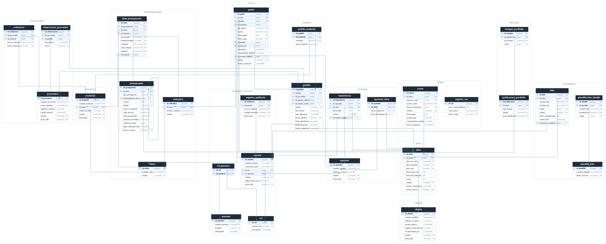

# Diccionario de Datos — SIGCO

**Sistema Integral de Gestión de Obras — Granica SRL**  
Santino Sciarretta · Proyecto Integrador Profesional · Ingeniería Informática

---

## Cómo se generó este documento

Este diccionario **no está escrito a mano**: se genera leyendo el esquema real
de la base de datos `sigco_dev` en PostgreSQL 17 (`docs/diagramas/scripts/
generar-diccionario.py`).

La razón es simple: un diccionario escrito aparte queda desactualizado apenas
una migración agrega una columna y nadie se acuerda de actualizarlo.
Generándolo desde la base, los tipos, los tamaños, las claves y las
restricciones que figuran acá **son exactamente los que la base tiene hoy**.

Lo único escrito a mano son las descripciones de negocio, porque el
significado de un campo no vive en el esquema.

El esquema, a su vez, lo define Flyway con migraciones versionadas
(`backend/src/main/resources/db/migration/`), y Hibernate está configurado en
`ddl-auto=validate`: **la aplicación no crea ni modifica tablas**, solo verifica
al arrancar que las entidades coincidan con la base. Si no coinciden, no
levanta.

## Diagrama entidad-relación

Las 28 tablas con sus columnas y las 41 claves foráneas que las vinculan.
Cada recuadro es una tabla, con su nombre en la cabecera; las columnas
marcadas `PK` son clave primaria y las `FK`, clave foránea, y de ellas salen
las flechas hacia la tabla que referencian.

La imagen se genera con `scripts/generar-erd.py`, que también lee la base
real. Hay una versión vectorial en `img/entidad-relacion-tablas.svg` para
imprimir o hacer zoom sin que se pixele.

---

## Convenciones

| Convención | Criterio |
| --- | --- |
| Idioma | Tablas y columnas en español, igual que en la documentación entregada. |
| Nombres | `snake_case` en la base, `PascalCase` en las clases Java. |
| Claves primarias | `BIGSERIAL` autoincremental, siempre `id_<entidad>`. |
| Importes | `NUMERIC` en la base, `BigDecimal` en Java. **Nunca `double`**, por los errores de redondeo. |
| Fechas | `DATE` cuando solo importa el día, `TIMESTAMP` cuando importa el momento exacto. |
| Estados | `VARCHAR` con una restricción `CHECK` que los limita a un conjunto cerrado. |
| Imágenes | La base guarda **la referencia** al archivo en Supabase Storage, nunca el binario. |
| Bajas | Casi nada se elimina: se desactiva, se cancela o se anula, para no perder la trazabilidad. |

**Columna "Nulo":** `NO` significa que el campo es obligatorio.  
**Columna "Clave":** `PK` clave primaria, `FK` clave foránea, `PK, FK` ambas
(típico de las tablas intermedias).

---

## Índice

- **Clientes** — `cliente`
- **Obras** — `obra`
- **Presupuestación** — `rubro`, `subrubro`, `presupuesto`, `item_presupuesto`
- **Materiales** — `material`
- **Proveedores** — `proveedor`, `cotizacion`, `observacion_proveedor`
- **Compras** — `pedido`, `pedido_material`
- **Gastos** — `gasto`
- **Personal** — `operario`, `operario_obra`, `inasistencia`
- **Seguimiento de Obras** — `hito`, `plantilla_hito`, `plantilla_hito_detalle`
- **Cobros** — `cuota`, `registro_cac`
- **Portfolio Web** — `publicacion_portfolio`, `imagen_portfolio`
- **Usuarios y Accesos** — `usuario`, `rol`, `permiso`, `rol_permiso`, `registro_auditoria`

**28 tablas · 180 columnas · 41 claves foráneas.**

---

## Módulo Clientes

### `cliente`

Clientes de la empresa, con el origen de la recomendación por la que llegaron.

| Columna | Tipo | Nulo | Clave | Referencia | Descripción |
| --- | --- | :-: | :-: | --- | --- |
| `id_cliente` | BIGSERIAL | NO | PK |  | Identificador del cliente. |
| `nombre_apellido` | VARCHAR(150) | NO |  |  | Nombre y apellido completo. |
| `telefono_contacto` | VARCHAR(30) | Sí |  |  | Teléfono de contacto. |
| `email_contacto` | VARCHAR(100) | Sí |  |  | Correo electrónico de contacto. |
| `origen_recomendacion` | VARCHAR(20) | Sí |  |  | Por qué canal llegó. Todos los clientes llegan por referido. |
| `recomendado_por` | VARCHAR(150) | Sí |  |  | Quién lo recomendó, en texto libre. |
| `estado` | VARCHAR(10) | NO |  |  | Activo / Inactivo. Un cliente no se elimina: se desactiva, para conservar sus obras. |
| `fecha_alta` | TIMESTAMP | NO |  |  | Momento en que se dio de alta en el sistema. |

**Reglas que impone la base:**

- `estado` solo admite: Activo / Inactivo
- `origen_recomendacion`, si se completa, solo admite: Cliente anterior / Arquitecto / Otro

---

## Módulo Obras

### `obra`

Entidad núcleo del sistema. Todo lo demás cuelga de una obra.

| Columna | Tipo | Nulo | Clave | Referencia | Descripción |
| --- | --- | :-: | :-: | --- | --- |
| `id_obra` | BIGSERIAL | NO | PK |  | Identificador de la obra. Es la entidad núcleo del sistema. |
| `id_cliente` | BIGINT | NO | FK | `cliente.id_cliente` | Cliente al que pertenece. |
| `direccion_obra` | VARCHAR(200) | NO |  |  | Dirección donde se ejecuta el trabajo. |
| `tipo_inmueble` | VARCHAR(15) | NO |  |  | Casa / Departamento / Local. |
| `tipo_obra` | VARCHAR(15) | NO |  |  | Construcción o Reforma. Determina el circuito de presupuestación y queda bloqueado apenas existe un anteproyecto o definitivo. |
| `fecha_inicio_real` | DATE | Sí |  |  | Fecha real de arranque. No se carga hasta que el presupuesto definitivo está aprobado. |
| `fecha_fin_estimada` | DATE | Sí |  |  | Fecha estimada de finalización. |
| `notas` | TEXT | Sí |  |  | Observaciones generales de la obra. |
| `estado` | VARCHAR(20) | NO |  |  | En presupuestación → En ejecución → Finalizada / Cancelada. Cambia solo al aprobarse el definitivo y al completarse el último hito. |
| `motivo_cancelacion` | VARCHAR(200) | Sí |  |  | Por qué se canceló. Una obra no se elimina, solo se cancela. |
| `fecha_creacion` | TIMESTAMP | NO |  |  | Momento en que se creó el registro. |

**Reglas que impone la base:**

- `estado` solo admite: En presupuestación / En ejecución / Finalizada / Cancelada
- `fecha_fin_estimada` no puede ser anterior a `fecha_inicio_real`
- `motivo_cancelacion` es obligatorio cuando `estado` = **Cancelada**
- `tipo_inmueble` solo admite: Casa / Departamento / Local
- `tipo_obra` solo admite: Construcción / Reforma

---

## Módulo Presupuestación

### `rubro`

Catálogo de rubros de trabajo. Es el eje sobre el que se comparan presupuesto y gastos.

| Columna | Tipo | Nulo | Clave | Referencia | Descripción |
| --- | --- | :-: | :-: | --- | --- |
| `id_rubro` | BIGSERIAL | NO | PK |  | Identificador del rubro. |
| `nombre_rubro` | VARCHAR(100) | NO |  |  | Nombre del rubro (Albañilería, Electricidad, Plomería…). |
| `estado` | VARCHAR(10) | NO |  |  | Un rubro ya usado en un presupuesto no se elimina: se desactiva. |

**Reglas que impone la base:**

- No se repite `nombre_rubro`, sin distinguir mayúsculas
- `estado` solo admite: Activo / Inactivo

### `subrubro`

Desagregación de un rubro. Pertenece a un único rubro.

| Columna | Tipo | Nulo | Clave | Referencia | Descripción |
| --- | --- | :-: | :-: | --- | --- |
| `id_subrubro` | BIGSERIAL | NO | PK |  | Identificador del subrubro. |
| `id_rubro` | BIGINT | NO | FK | `rubro.id_rubro` | Rubro al que pertenece. Un subrubro pertenece a un único rubro. |
| `nombre_subrubro` | VARCHAR(100) | NO |  |  | Nombre del subrubro. |
| `estado` | VARCHAR(10) | NO |  |  | Igual que en rubro: se desactiva, no se borra. |

**Reglas que impone la base:**

- No se repite `id_rubro, nombre_subrubro`, sin distinguir mayúsculas
- `estado` solo admite: Activo / Inactivo

### `presupuesto`

Cabecera del presupuesto, en cualquiera de sus tres instancias.

| Columna | Tipo | Nulo | Clave | Referencia | Descripción |
| --- | --- | :-: | :-: | --- | --- |
| `id_presupuesto` | BIGSERIAL | NO | PK |  | Identificador del presupuesto. |
| `id_obra` | BIGINT | NO | FK | `obra.id_obra` | Obra a la que pertenece. |
| `tipo_presupuesto` | VARCHAR(20) | NO |  |  | Cotización inicial / Anteproyecto / Definitivo / Adicional. Son las tres instancias reales del proceso, más los adicionales. |
| `id_presupuesto_base` | BIGINT | Sí | FK | `presupuesto.id_presupuesto` | Presupuesto del que deriva (autorreferencia). Así el definitivo toma el anteproyecto como base **sin sobreescribirlo**: quedan los dos. |
| `version` | INTEGER | NO |  |  | Número de versión dentro de la cadena de revisiones. |
| `estado` | VARCHAR(15) | NO |  |  | Borrador / Enviado / Aprobado / Rechazado. Solo el dueño aprueba. |
| `metros_cuadrados` | NUMERIC(10,2) | Sí |  |  | Metros cuadrados. Solo se usa en la cotización inicial (m² × valor/m²). |
| `valor_por_m2` | NUMERIC(12,2) | Sí |  |  | Valor del metro cuadrado usado en la cotización inicial. |
| `total_presupuesto` | NUMERIC(14,2) | Sí |  |  | Total. En el definitivo sale de sumar los ítems; en la cotización inicial, de m² × valor/m². |
| `anticipo_porcentaje` | NUMERIC(5,2) | Sí |  |  | Porcentaje que se cobra como anticipo. Es la cuota cero del plan de cobro. |
| `cantidad_cuotas` | INTEGER | Sí |  |  | Cantidad de cuotas del plan, sin contar el anticipo. |
| `plazo_estimado_obra` | VARCHAR(100) | Sí |  |  | Plazo estimado, en texto (por ejemplo "4 meses"). |
| `fecha_creacion` | TIMESTAMP | NO |  |  | Momento en que se creó el registro. |

**Reglas que impone la base:**

- `anticipo_porcentaje`, si se completa, tiene que estar entre 0 y 100
- `cantidad_cuotas`, si se completa, no puede ser negativo
- `estado` solo admite: Borrador / Enviado / Aprobado / Rechazado
- `id_presupuesto_base` no puede apuntar al propio registro
- `tipo_presupuesto` solo admite: Cotización inicial / Anteproyecto / Definitivo / Adicional
- `version` no puede ser menor a 1

### `item_presupuesto`

Renglones del presupuesto definitivo, con su precio unitario interno.

| Columna | Tipo | Nulo | Clave | Referencia | Descripción |
| --- | --- | :-: | :-: | --- | --- |
| `id_item` | BIGSERIAL | NO | PK |  | Identificador del ítem. |
| `id_presupuesto` | BIGINT | NO | FK | `presupuesto.id_presupuesto` | Presupuesto al que pertenece el ítem. |
| `id_rubro` | BIGINT | NO | FK | `rubro.id_rubro` | Rubro al que corresponde. |
| `id_subrubro` | BIGINT | Sí | FK | `subrubro.id_subrubro` | Subrubro al que corresponde. |
| `descripcion` | VARCHAR(250) | NO |  |  | Qué se cotiza. Es lo único de esta tabla que ve el cliente en el PDF. |
| `unidad_medida` | VARCHAR(20) | NO |  |  | Unidad en que se mide (m², bolsa, unidad, jornal…). |
| `cantidad` | NUMERIC(12,2) | NO |  |  | Cantidad cotizada. |
| `valor_unitario` | NUMERIC(12,2) | NO |  |  | Precio unitario. **Es información interna: no aparece en el PDF del cliente**, que muestra solo subtotales por rubro. |
| `subtotal` | NUMERIC(14,2) | NO |  |  | cantidad × valor_unitario. Se guarda calculado para que el total del presupuesto no dependa de recalcularlo en cada consulta. |
| `id_material` | BIGINT | Sí | FK | `material.id_material` | Material del catálogo, si el ítem es un material. **Columna agregada en `V7`**, ausente en el Diccionario original: sin ella la descripción quedaba como texto libre y se reproducía el problema que Materiales viene a resolver. Es opcional porque no todo ítem es un material (mano de obra, dirección de obra). |

**Reglas que impone la base:**

- `cantidad` tiene que ser mayor a cero
- `valor_unitario` no puede ser negativo

---

## Módulo Materiales

### `material`

Catálogo único de materiales, del que eligen Presupuestación y Compras.

| Columna | Tipo | Nulo | Clave | Referencia | Descripción |
| --- | --- | :-: | :-: | --- | --- |
| `id_material` | BIGSERIAL | NO | PK |  | Identificador del material. |
| `nombre_material` | VARCHAR(150) | NO |  |  | Nombre del material. Reemplaza los nombres escritos a mano, distintos en cada obra. |
| `id_rubro` | BIGINT | NO | FK | `rubro.id_rubro` | Rubro al que pertenece el material. |
| `unidad_medida` | VARCHAR(20) | NO |  |  | Unidad de compra (bolsa, m², unidad…). Lista abierta a propósito. |
| `estado` | VARCHAR(10) | NO |  |  | Un material usado en presupuestos o pedidos no se elimina: se desactiva. |
| `fecha_alta` | TIMESTAMP | NO |  |  | Momento en que se dio de alta en el sistema. |

**Reglas que impone la base:**

- No se repite `id_rubro, nombre_material`, sin distinguir mayúsculas
- `estado` solo admite: Activo / Inactivo

---

## Módulo Proveedores

### `proveedor`

Corralones y proveedores, organizados por zona de cobertura.

| Columna | Tipo | Nulo | Clave | Referencia | Descripción |
| --- | --- | :-: | :-: | --- | --- |
| `id_proveedor` | BIGSERIAL | NO | PK |  | Identificador del proveedor. |
| `nombre_proveedor` | VARCHAR(150) | NO |  |  | Nombre del corralón o proveedor. |
| `zona_cobertura` | VARCHAR(100) | NO |  |  | Zona geográfica donde entrega. Es el criterio con el que hoy se elige a quién pedirle. |
| `telefono_contacto` | VARCHAR(30) | Sí |  |  | Teléfono de contacto. |
| `email_contacto` | VARCHAR(100) | Sí |  |  | Correo electrónico de contacto. |
| `estado` | VARCHAR(10) | NO |  |  | Estado del registro. |
| `fecha_alta` | TIMESTAMP | NO |  |  | Momento en que se dio de alta en el sistema. |

**Reglas que impone la base:**

- No se repite `nombre_proveedor, zona_cobertura`, sin distinguir mayúsculas
- `estado` solo admite: Activo / Inactivo

### `cotizacion`

Historial de precios cotizados por proveedor y material.

| Columna | Tipo | Nulo | Clave | Referencia | Descripción |
| --- | --- | :-: | :-: | --- | --- |
| `id_cotizacion` | BIGSERIAL | NO | PK |  | Identificador de la cotización. |
| `id_proveedor` | BIGINT | NO | FK | `proveedor.id_proveedor` | Proveedor asociado. |
| `id_material` | BIGINT | NO | FK | `material.id_material` | Material del catálogo. |
| `precio_cotizado` | NUMERIC(12,2) | NO |  |  | Precio que cotizó ese proveedor para ese material. |
| `fecha_cotizacion` | TIMESTAMP | NO |  |  | Cuándo se registró. Se guarda el historial completo: no se pisa la cotización anterior. |

**Reglas que impone la base:**

- `precio_cotizado` no puede ser negativo

### `observacion_proveedor`

Comportamiento observado de un proveedor: demoras, faltantes, diferencias.

| Columna | Tipo | Nulo | Clave | Referencia | Descripción |
| --- | --- | :-: | :-: | --- | --- |
| `id_observacion` | BIGSERIAL | NO | PK |  | Identificador de la observación. |
| `id_proveedor` | BIGINT | NO | FK | `proveedor.id_proveedor` | Proveedor asociado. |
| `id_pedido` | BIGINT | Sí | FK | `pedido.id_pedido` | Pedido que originó la observación, si la hubo. |
| `descripcion` | VARCHAR(300) | NO |  |  | Comportamiento observado: demoras, faltantes, diferencias de precio. |
| `fecha` | TIMESTAMP | NO |  |  | Cuándo se registró la observación. |

---

## Módulo Compras

### `pedido`

Pedido de materiales: el circuito que reemplaza al WhatsApp.

| Columna | Tipo | Nulo | Clave | Referencia | Descripción |
| --- | --- | :-: | :-: | --- | --- |
| `id_pedido` | BIGSERIAL | NO | PK |  | Identificador del pedido. Reemplaza el pedido por WhatsApp, que no dejaba registro. |
| `id_obra` | BIGINT | NO | FK | `obra.id_obra` | Obra a la que pertenece. |
| `id_proveedor` | BIGINT | Sí | FK | `proveedor.id_proveedor` | Proveedor al que se le compra. **Es opcional al crear el pedido**: el dueño elige el proveedor recién al aprobarlo. |
| `id_usuario_solicita` | BIGINT | Sí | FK | `usuario.id_usuario` | Quién pidió (normalmente el capataz). *Pendiente hasta Accesos.* |
| `id_usuario_recibe` | BIGINT | Sí | FK | `usuario.id_usuario` | Quién confirmó la recepción en obra. *Pendiente hasta Accesos.* |
| `estado` | VARCHAR(25) | NO |  |  | Pendiente de Aprobación → Enviado al Proveedor → Recibido Completo / Recibido con Diferencias / Anulado. |
| `foto_remito` | VARCHAR(255) | Sí |  |  | Referencia de la foto del remito en Supabase Storage. La base guarda la URL, nunca la imagen. |
| `nota_diferencia` | VARCHAR(300) | Sí |  |  | Qué faltó o llegó distinto. Obligatoria si hubo diferencias, y es lo que determina el estado de recepción. |
| `fecha_solicitud` | TIMESTAMP | NO |  |  | Cuándo se generó el pedido. |
| `fecha_aprobacion` | TIMESTAMP | Sí |  |  | Cuándo lo aprobó el dueño. La aprobación no es delegable. |
| `fecha_recepcion` | TIMESTAMP | Sí |  |  | Cuándo se confirmó la recepción en obra. |
| `motivo_anulacion` | VARCHAR(200) | Sí |  |  | Motivo por el que se anuló. Obligatorio al anular. |

**Reglas que impone la base:**

- `estado` solo admite: Pendiente de Aprobación / Enviado al Proveedor / Recibido Completo / Recibido con Diferencias / Anulado
- `id_proveedor` es obligatorio salvo que `estado` sea **Pendiente de Aprobación** o **Anulado**
- `motivo_anulacion` es obligatorio cuando `estado` = **Anulado**
- `nota_diferencia` es obligatorio cuando `estado` = **Recibido con Diferencias**

### `pedido_material`

Qué materiales y en qué cantidad tiene cada pedido.

| Columna | Tipo | Nulo | Clave | Referencia | Descripción |
| --- | --- | :-: | :-: | --- | --- |
| `id_pedido` | BIGINT | NO | PK, FK | `pedido.id_pedido` | Pedido de materiales asociado. |
| `id_material` | BIGINT | NO | PK, FK | `material.id_material` | Material del catálogo. |
| `cantidad` | NUMERIC(12,2) | NO |  |  | Cantidad pedida de ese material. |
| `precio_unitario` | NUMERIC(12,2) | Sí |  |  | Precio unitario acordado. **Agregado en `V9`**: sin él no había de dónde sacar el monto del gasto que se genera al recibir el pedido. |

**Reglas que impone la base:**

- `cantidad` tiene que ser mayor a cero
- `precio_unitario`, si se completa, no puede ser negativo

---

## Módulo Gastos

### `gasto`

Cada gasto de la obra, clasificado por rubro y tipo, para comparar contra lo presupuestado.

| Columna | Tipo | Nulo | Clave | Referencia | Descripción |
| --- | --- | :-: | :-: | --- | --- |
| `id_gasto` | BIGSERIAL | NO | PK |  | Identificador del gasto. |
| `id_obra` | BIGINT | NO | FK | `obra.id_obra` | Obra a la que pertenece. |
| `id_rubro` | BIGINT | NO | FK | `rubro.id_rubro` | Rubro al que corresponde. |
| `id_subrubro` | BIGINT | Sí | FK | `subrubro.id_subrubro` | Subrubro al que corresponde. |
| `tipo_gasto` | VARCHAR(15) | NO |  |  | Material / Mano de Obra / **Gasto Hormiga** / Otro. El Gasto Hormiga son los gastos chicos que hoy se pierden: es el problema central que el módulo resuelve. |
| `monto` | NUMERIC(14,2) | NO |  |  | Importe del gasto. |
| `fecha_gasto` | DATE | NO |  |  | Cuándo se hizo el gasto. |
| `fecha_carga` | TIMESTAMP | NO |  |  | Cuándo se cargó en el sistema. Puede ser posterior a `fecha_gasto`. |
| `id_pedido` | BIGINT | Sí | FK | `pedido.id_pedido` | Pedido que lo originó, si el gasto vino de una recepción de materiales. |
| `id_operario` | BIGINT | Sí | FK | `operario.id_operario` | Operario al que corresponde, si es mano de obra. |
| `descripcion` | VARCHAR(250) | Sí |  |  | Texto libre descriptivo. |
| `comprobante_adjunto` | VARCHAR(255) | Sí |  |  | Referencia del comprobante en Supabase Storage. |
| `id_usuario_registro` | BIGINT | Sí | FK | `usuario.id_usuario` | Usuario que cargó el registro. *Pendiente hasta el módulo Accesos.* |
| `estado` | VARCHAR(12) | NO |  |  | Confirmado / Anulado. Un gasto no se elimina: se anula con motivo, para no romper la comparación contra el presupuesto. |
| `motivo_anulacion` | VARCHAR(200) | Sí |  |  | Motivo por el que se anuló. Obligatorio al anular. |

**Reglas que impone la base:**

- `estado` solo admite: Confirmado / Anulado
- `monto` tiene que ser mayor a cero
- `motivo_anulacion` es obligatorio cuando `estado` = **Anulado**
- `tipo_gasto` solo admite: Material / Mano de Obra / Gasto Hormiga / Otro

---

## Módulo Personal

### `operario`

Operarios de la empresa, trabajen o no con el sistema.

| Columna | Tipo | Nulo | Clave | Referencia | Descripción |
| --- | --- | :-: | :-: | --- | --- |
| `id_operario` | BIGSERIAL | NO | PK |  | Identificador del operario. Distinto de `usuario`: acá se registran todos, trabajen o no con el sistema. |
| `nombre_apellido` | VARCHAR(150) | NO |  |  | Nombre y apellido completo. |
| `telefono_contacto` | VARCHAR(30) | Sí |  |  | Teléfono de contacto. |
| `estado` | VARCHAR(10) | NO |  |  | Al pasar a Inactivo se lo desvincula de las obras activas, pero se conserva su historial. |
| `fecha_alta` | TIMESTAMP | NO |  |  | Momento en que se dio de alta en el sistema. |

**Reglas que impone la base:**

- `estado` solo admite: Activo / Inactivo

### `operario_obra`

Qué operarios están asignados a qué obras, y desde cuándo hasta cuándo.

| Columna | Tipo | Nulo | Clave | Referencia | Descripción |
| --- | --- | :-: | :-: | --- | --- |
| `id_operario` | BIGINT | NO | PK, FK | `operario.id_operario` | Operario al que corresponde. |
| `id_obra` | BIGINT | NO | PK, FK | `obra.id_obra` | Obra a la que pertenece. |
| `fecha_asignacion` | DATE | NO |  |  | Desde cuándo trabaja en esa obra. |
| `fecha_desasignacion` | DATE | Sí |  |  | Hasta cuándo. **Agregada en `V11`**: desasignar borrando la fila destruía el historial que el informe pide conservar. |

**Reglas que impone la base:**

- `fecha_desasignacion` no puede ser anterior a `fecha_asignacion`

### `inasistencia`

Faltas de un operario en una obra determinada.

| Columna | Tipo | Nulo | Clave | Referencia | Descripción |
| --- | --- | :-: | :-: | --- | --- |
| `id_inasistencia` | BIGSERIAL | NO | PK |  | Identificador de la inasistencia. |
| `id_operario` | BIGINT | NO | FK | `operario.id_operario` | Operario al que corresponde. |
| `id_obra` | BIGINT | NO | FK | `obra.id_obra` | Obra a la que pertenece. |
| `fecha_falta` | DATE | NO |  |  | Día que faltó. |
| `motivo` | VARCHAR(200) | Sí |  |  | Motivo de la falta. **No es obligatorio**: muchas veces no se sabe. |
| `id_usuario_registro` | BIGINT | Sí | FK | `usuario.id_usuario` | Usuario que cargó el registro. *Pendiente hasta el módulo Accesos.* |

**Reglas que impone la base:**

- No se repite `id_operario, id_obra, fecha_falta`

---

## Módulo Seguimiento de Obras

### `hito`

Hitos ponderados de una obra. De acá sale el porcentaje de avance físico.

| Columna | Tipo | Nulo | Clave | Referencia | Descripción |
| --- | --- | :-: | :-: | --- | --- |
| `id_hito` | BIGSERIAL | NO | PK |  | Identificador del hito. |
| `id_obra` | BIGINT | NO | FK | `obra.id_obra` | Obra a la que pertenece. |
| `nombre_hito` | VARCHAR(150) | NO |  |  | Nombre del hito (Demolición, Instalación eléctrica, Terminaciones…). |
| `ponderacion` | NUMERIC(5,2) | NO |  |  | Cuánto pesa este hito en el avance total. La suma de los hitos de una obra debe dar 100. |
| `orden` | INTEGER | NO |  |  | Orden de ejecución dentro de la obra. |
| `estado` | VARCHAR(12) | NO |  |  | Pendiente / Completado. El porcentaje de avance sale de los hitos completados por su ponderación. |
| `fecha_cumplimiento` | DATE | Sí |  |  | Cuándo se completó. Obligatoria al marcarlo como Completado. |
| `observacion` | VARCHAR(250) | Sí |  |  | Comentario del capataz al completar el hito. |
| `id_usuario_completa` | BIGINT | Sí | FK | `usuario.id_usuario` | Quién lo marcó como completado. *Pendiente hasta Accesos.* |

**Reglas que impone la base:**

- No se repite `id_obra, nombre_hito`, sin distinguir mayúsculas
- No se repite `id_obra, orden`
- `estado` solo admite: Pendiente / Completado
- `fecha_cumplimiento` es obligatorio cuando `estado` = **Completado**
- `ponderacion` tiene que estar entre 0 (exclusive) y 100

### `plantilla_hito`

Plantillas de hitos reutilizables para obras similares.

| Columna | Tipo | Nulo | Clave | Referencia | Descripción |
| --- | --- | :-: | :-: | --- | --- |
| `id_plantilla` | BIGSERIAL | NO | PK |  | Identificador de la plantilla. |
| `nombre_plantilla` | VARCHAR(100) | NO |  |  | Nombre de la plantilla, reutilizable en obras similares. |
| `fecha_creacion` | TIMESTAMP | NO |  |  | Momento en que se creó el registro. |

**Reglas que impone la base:**

- No se repite `nombre_plantilla`, sin distinguir mayúsculas

### `plantilla_hito_detalle`

Hitos que compone cada plantilla.

| Columna | Tipo | Nulo | Clave | Referencia | Descripción |
| --- | --- | :-: | :-: | --- | --- |
| `id_detalle` | BIGSERIAL | NO | PK |  | Identificador de la línea de la plantilla. |
| `id_plantilla` | BIGINT | NO | FK | `plantilla_hito.id_plantilla` | Plantilla a la que pertenece. |
| `nombre_hito` | VARCHAR(150) | NO |  |  | Nombre del hito que se va a crear al aplicar la plantilla. |
| `ponderacion` | NUMERIC(5,2) | NO |  |  | Ponderación con la que se crea el hito. |
| `orden` | INTEGER | NO |  |  | Posición dentro de la secuencia. |

**Reglas que impone la base:**

- `ponderacion` tiene que estar entre 0 (exclusive) y 100

---

## Módulo Cobros

### `cuota`

Plan de cobro de la obra. El anticipo es la cuota cero.

| Columna | Tipo | Nulo | Clave | Referencia | Descripción |
| --- | --- | :-: | :-: | --- | --- |
| `id_cuota` | BIGSERIAL | NO | PK |  | Identificador de la cuota. |
| `id_obra` | BIGINT | NO | FK | `obra.id_obra` | Obra a la que pertenece. |
| `numero_cuota` | INTEGER | NO |  |  | **El anticipo es la cuota cero.** Vive en la misma tabla que el resto para que el saldo salga de una sola consulta. |
| `monto_cuota` | NUMERIC(14,2) | NO |  |  | Importe de la cuota. Se recalcula al aplicar el índice CAC, solo si está pendiente. |
| `fecha_vencimiento` | DATE | NO |  |  | Cuándo vence. Las cuotas son quincenales. |
| `estado` | VARCHAR(12) | NO |  |  | Pendiente / Abonada / Vencida. **Vencida se deriva del calendario**, nadie la marca a mano. |
| `fecha_pago` | DATE | Sí |  |  | Cuándo se cobró. Obligatoria al marcarla Abonada. |
| `medio_pago` | VARCHAR(15) | Sí |  |  | Transferencia / Efectivo / Cheque. |
| `comprobante_emitido` | VARCHAR(20) | Sí |  |  | Qué se le entregó al cliente: Mensaje / Recibo / Planilla. |
| `motivo_anulacion` | VARCHAR(200) | Sí |  |  | Motivo al anular un pago. Lo que se anula es **el pago**: la cuota vuelve a Pendiente y se sigue debiendo. |

**Reglas que impone la base:**

- No se repite `id_obra, numero_cuota`
- `comprobante_emitido`, si se completa, solo admite: Mensaje / Recibo / Planilla
- `estado` solo admite: Pendiente / Abonada / Vencida
- `fecha_pago` es obligatorio cuando `estado` = **Abonada**
- `medio_pago`, si se completa, solo admite: Transferencia / Efectivo / Cheque
- `monto_cuota` tiene que ser mayor a cero
- `numero_cuota` no puede ser negativo

### `registro_cac`

Índice CAC por mes, cargado a mano, para actualizar el saldo.

| Columna | Tipo | Nulo | Clave | Referencia | Descripción |
| --- | --- | :-: | :-: | --- | --- |
| `id_cac` | BIGSERIAL | NO | PK |  | Identificador del registro del índice. |
| `mes_correspondiente` | DATE | NO |  |  | Mes al que corresponde el índice. |
| `valor_indice` | NUMERIC(8,4) | NO |  |  | Valor del índice CAC. Es un número absoluto: el ajuste sale de dividirlo por el del mes anterior. Se carga a mano. |
| `fecha_carga` | TIMESTAMP | NO |  |  | Cuándo se cargó el valor. |

**Reglas que impone la base:**

- No se repite `mes_correspondiente`
- `valor_indice` tiene que ser mayor a cero

---

## Módulo Portfolio Web

### `publicacion_portfolio`

Obra terminada publicada en la vidriera.

| Columna | Tipo | Nulo | Clave | Referencia | Descripción |
| --- | --- | :-: | :-: | --- | --- |
| `id_publicacion` | BIGSERIAL | NO | PK |  | Identificador de la publicación. |
| `id_obra` | BIGINT | NO | FK | `obra.id_obra` | Obra que se publica. Solo obras finalizadas, y una obra no puede tener dos publicaciones. |
| `tipo_trabajo` | VARCHAR(30) | NO |  |  | Cómo se agrupa en la vidriera (Construcción, Refacción, Decoración de local…). Lista abierta. |
| `estado` | VARCHAR(15) | NO |  |  | Publicada / Despublicada. La publicación nace despublicada: primero se cargan las fotos. |
| `fecha_publicacion` | TIMESTAMP | NO |  |  | Cuándo se publicó. |

**Reglas que impone la base:**

- No se repite `id_obra`
- `estado` solo admite: Publicada / Despublicada

### `imagen_portfolio`

Fotos de una publicación.

| Columna | Tipo | Nulo | Clave | Referencia | Descripción |
| --- | --- | :-: | :-: | --- | --- |
| `id_imagen` | BIGSERIAL | NO | PK |  | Identificador de la imagen. |
| `id_publicacion` | BIGINT | NO | FK | `publicacion_portfolio.id_publicacion` | Publicación a la que pertenece. |
| `url_imagen` | VARCHAR(255) | NO |  |  | Referencia de la imagen en Supabase Storage. |
| `orden` | INTEGER | NO |  |  | Orden en que se muestra en la galería. |

**Reglas que impone la base:**

- `orden` no puede ser negativo

---

## Módulo Usuarios y Accesos

### `usuario`

Cuentas de acceso al sistema.

| Columna | Tipo | Nulo | Clave | Referencia | Descripción |
| --- | --- | :-: | :-: | --- | --- |
| `id_usuario` | BIGSERIAL | NO | PK |  | Identificador de la cuenta de acceso. |
| `nombre_usuario` | VARCHAR(50) | NO |  |  | Nombre con el que ingresa al sistema. |
| `contrasena_hash` | VARCHAR(255) | NO |  |  | Contraseña cifrada con BCrypt (hash + sal). **Nunca se guarda en texto plano.** |
| `id_rol` | BIGINT | NO | FK | `rol.id_rol` | Rol que determina qué puede hacer. |
| `id_operario` | BIGINT | Sí | FK | `operario.id_operario` | Vínculo opcional con el registro de Personal, para que un capataz confirme recepciones desde el celular. |
| `estado` | VARCHAR(10) | NO |  |  | Activo / Inactivo. Una cuenta no se elimina: se desactiva, para conservar la auditoría. |
| `ultima_fecha_acceso` | TIMESTAMP | Sí |  |  | Último ingreso al sistema. |
| `fecha_alta` | TIMESTAMP | NO |  |  | Momento en que se dio de alta en el sistema. |

**Reglas que impone la base:**

- No se repite `id_operario` (solo cuando está cargado)
- No se repite `nombre_usuario`, sin distinguir mayúsculas
- `estado` solo admite: Activo / Inactivo

### `rol`

Roles del sistema.

| Columna | Tipo | Nulo | Clave | Referencia | Descripción |
| --- | --- | :-: | :-: | --- | --- |
| `id_rol` | BIGSERIAL | NO | PK |  | Identificador del rol. |
| `nombre_rol` | VARCHAR(50) | NO |  |  | Dueño / Capataz General / Capataz de Obra. |
| `descripcion` | VARCHAR(200) | Sí |  |  | Qué alcance tiene el rol. |

**Reglas que impone la base:**

- No se repite `nombre_rol`, sin distinguir mayúsculas

### `permiso`

Permisos individuales que se agrupan en roles.

| Columna | Tipo | Nulo | Clave | Referencia | Descripción |
| --- | --- | :-: | :-: | --- | --- |
| `id_permiso` | BIGSERIAL | NO | PK |  | Identificador del permiso. |
| `nombre_permiso` | VARCHAR(100) | NO |  |  | Acción concreta que habilita. |
| `modulo` | VARCHAR(50) | NO |  |  | Módulo sobre el que aplica. |
| `descripcion` | VARCHAR(200) | Sí |  |  | Qué habilita hacer. |

**Reglas que impone la base:**

- No se repite `nombre_permiso`, sin distinguir mayúsculas

### `rol_permiso`

Qué permisos tiene cada rol (relación muchos a muchos).

| Columna | Tipo | Nulo | Clave | Referencia | Descripción |
| --- | --- | :-: | :-: | --- | --- |
| `id_rol` | BIGINT | NO | PK, FK | `rol.id_rol` | Referencia a `rol`. |
| `id_permiso` | BIGINT | NO | PK, FK | `permiso.id_permiso` | Referencia a `permiso`. |

### `registro_auditoria`

Traza de las acciones sensibles: quién, qué, dónde y cuándo.

| Columna | Tipo | Nulo | Clave | Referencia | Descripción |
| --- | --- | :-: | :-: | --- | --- |
| `id_auditoria` | BIGSERIAL | NO | PK |  | Identificador del registro de auditoría. |
| `id_usuario` | BIGINT | NO | FK | `usuario.id_usuario` | Quién hizo la acción. |
| `accion_realizada` | VARCHAR(150) | NO |  |  | Qué hizo. |
| `modulo_afectado` | VARCHAR(50) | NO |  |  | Sobre qué módulo. |
| `fecha_hora` | TIMESTAMP | NO |  |  | Cuándo. Solo se auditan las acciones sensibles. |

---

## Diferencias respecto del Diccionario de la Propuesta Técnica

El Diccionario original se escribió durante el análisis, antes de programar.
Al implementarlo aparecieron ocho puntos donde el modelo no alcanzaba para
sostener una regla que el propio informe pide. Cada cambio es una migración
de Flyway, y está justificado en el `.md` del módulo correspondiente.

| Migración | Cambio | Por qué |
| --- | --- | --- |
| `V7` | `item_presupuesto.id_material` | El informe dice que los ítems se eligen del catálogo de Materiales, pero no había columna para guardar cuál: la descripción quedaba como texto libre, que es el problema que Materiales resuelve. |
| `V9` | `pedido.id_proveedor` pasa a opcional | El dueño elige el proveedor **al aprobar** el pedido, no al crearlo. Exigirlo antes obligaba a inventar un dato. |
| `V9` | `pedido.motivo_anulacion` | No había dónde registrar por qué se anuló un pedido. |
| `V9` | `pedido_material.precio_unitario` | Al recibir un pedido se genera el gasto automáticamente, y no había de dónde sacar el importe. |
| `V10` | `gasto.estado`: Registrado → Confirmado | El informe usa Confirmado / Anulado. |
| `V11` | `operario_obra.fecha_desasignacion` | Desasignar borrando la fila destruía el historial que el informe pide conservar al dar de baja a un operario. |
| `V12` | `cuota.motivo_anulacion` | Una cuota abonada se anula dejando motivo, y no había columna. |
| `V12` | `publicacion_portfolio.estado` queda en dos valores | El informe enumera Publicada / Despublicada; el tercer estado no agregaba nada. |

Fuera de eso, **las 28 tablas, sus nombres, sus tipos y sus claves son los
del Diccionario original**: se verificó columna por columna contra el
documento entregado.

