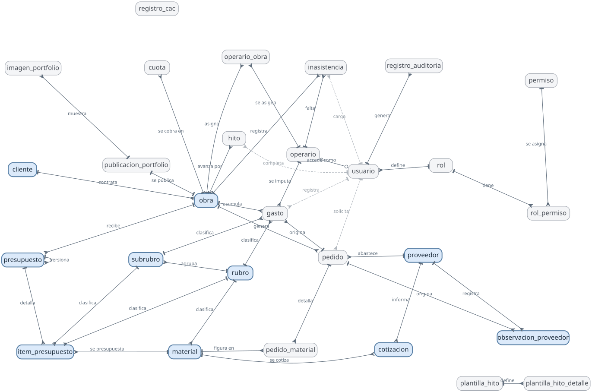
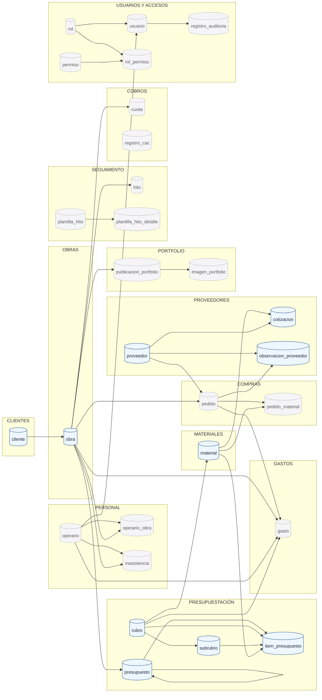
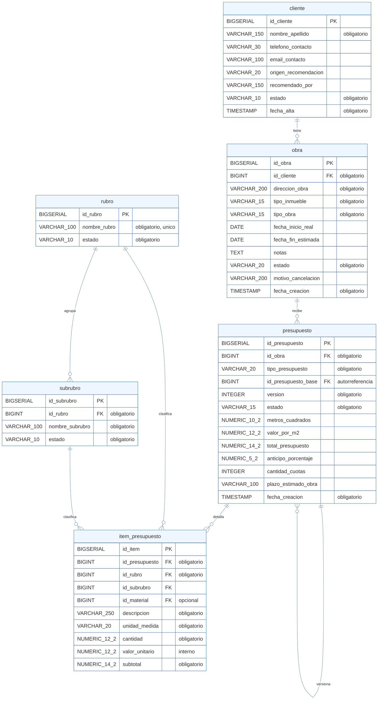
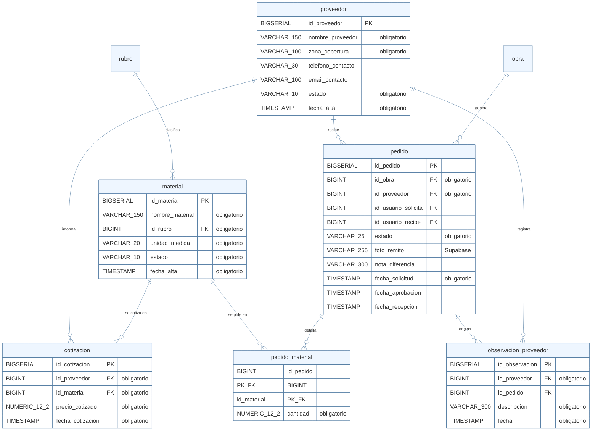
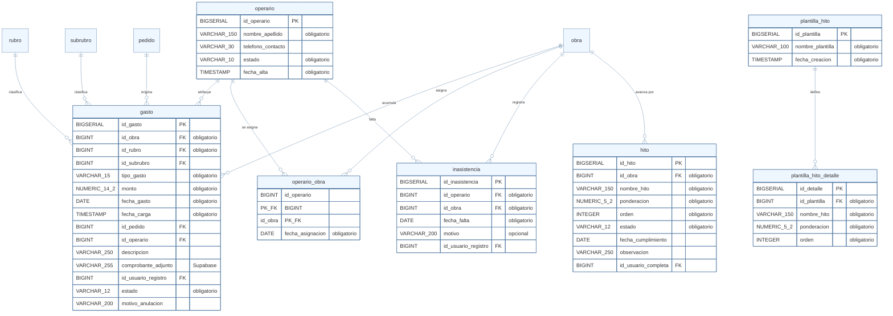
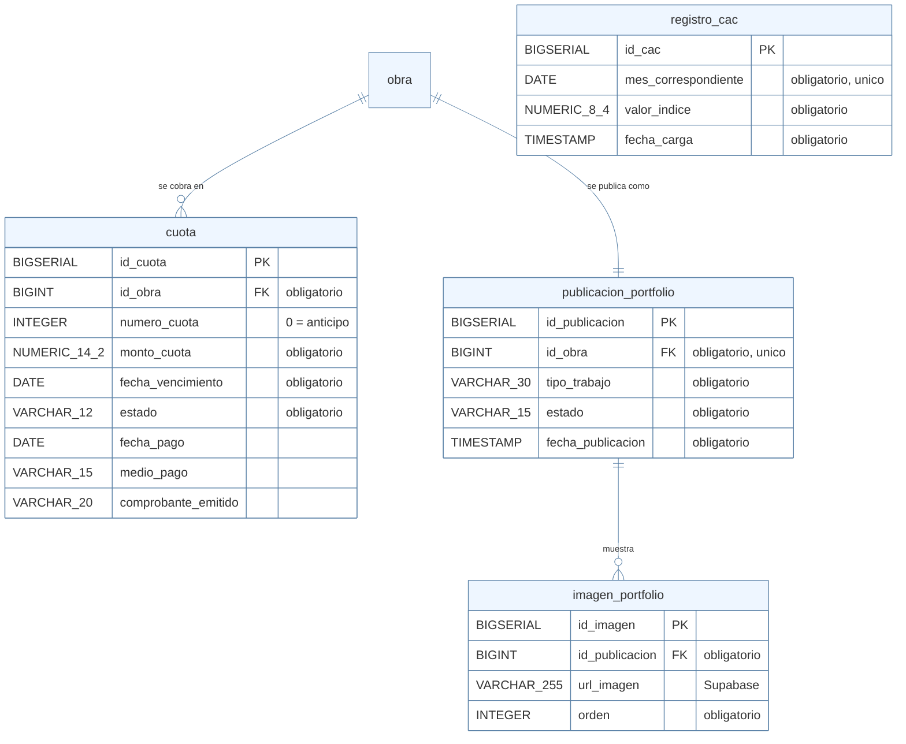
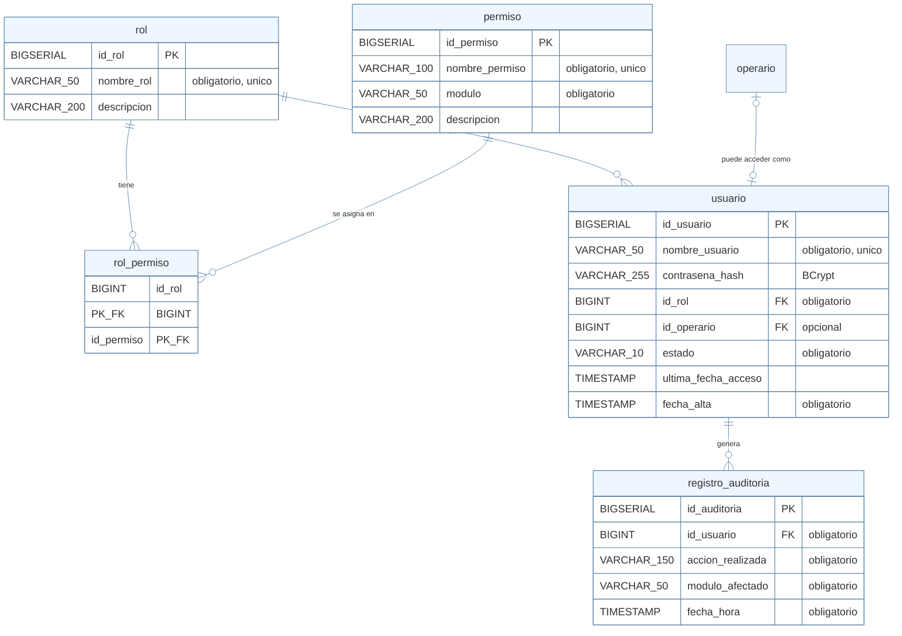

# Diagrama del modelo de datos — SIGCO

**28 tablas**, creadas por 8 migraciones de Flyway sobre PostgreSQL 17.

Este diagrama es el reflejo exacto de la base `sigco_dev`, verificado campo por
campo contra el Diccionario de Datos del informe: **cero diferencias** en
nombres, tipos, obligatoriedad, claves primarias y foráneas.

No es un dibujo que haya que mantener a mano: se puede volver a verificar contra
la base en cualquier momento.

> **Estado de desarrollo.** Las 28 tablas existen, pero solo 5 módulos están
> implementados (Clientes, Obras, Presupuestación, Materiales, Proveedores). Las
> tablas de los 9 módulos restantes están creadas y vacías, esperando su módulo.

---

## 1. Diagrama entidad-relación

Las 28 entidades y sus 40 relaciones, en notación pata de gallo (*crow's foot*).



> Si el diagrama no se ve, está también en
> [`img/entidad-relacion.png`](img/entidad-relacion.png).

**Cómo leerlo**

| Símbolo | Significa |
| --- | --- |
| Trazo perpendicular (⊢) | Lado «uno» de la relación |
| Pata de gallo (⋔) | Lado «muchos» |
| Círculo (○) | Opcional: puede no haber ninguno |
| Línea llena | Relación del negocio |
| Línea punteada | Trazabilidad: qué usuario registró el movimiento |
| Borde azul marcado | Entidad de un módulo ya desarrollado |
| Borde gris | Tabla creada, módulo pendiente |

**Qué se ve a simple vista**

`obra` es el centro del sistema: de ella cuelgan presupuestos, pedidos, gastos,
hitos, cuotas, asignaciones de personal y la publicación del portfolio. Es la
razón por la que Obras es el segundo módulo del orden de desarrollo y por la que
casi ningún otro puede funcionar sin él.

`rubro` es el segundo punto de convergencia: clasifica ítems de presupuesto,
materiales y gastos. Esa clasificación compartida es lo que hace posible
comparar lo presupuestado contra lo gastado, que es el corazón del módulo Gastos.

Las cuatro relaciones punteadas hacia `usuario` se dibujan aparte a propósito:
son trazabilidad («quién cargó esto»), no relaciones del negocio, y mezclarlas
con las llenas haría ilegible el diagrama sin agregar información.

`registro_cac` aparece suelta porque lo está: guarda el índice de la Cámara
Argentina de la Construcción mes a mes y no pertenece a ninguna obra en
particular, sirve a todas.

**Fuente:** [`entidad-relacion.dot`](entidad-relacion.dot), en formato Graphviz.
Se regenera con `dot -Kneato -Tsvg entidad-relacion.dot -o img/entidad-relacion.svg`.

---

## 2. Mapa por módulos

Las 28 entidades y sus relaciones, agrupadas por módulo.



> **Azul: módulo desarrollado. Gris: tabla creada, módulo pendiente.**
> `registro_cac` aparece sin conexiones a propósito: es una tabla de referencia
> que no pertenece a ninguna obra en particular, sirve a todas.

---

## 3. Núcleo del negocio — Clientes, Obras y Presupuestación

Es el corazón del sistema: sin obra no hay presupuesto, y sin presupuesto no hay
contra qué comparar los gastos ni de dónde sacar el plan de cobro.



**La autorreferencia de `presupuesto` es la pieza más importante del modelo.**
`id_presupuesto_base` apunta al presupuesto del que salió éste. El definitivo no
sobrescribe al anteproyecto: son dos registros independientes vinculados. Así se
reconstruye la negociación completa, que es exactamente lo que hoy se pierde
cuando cada versión pisa el archivo de Excel anterior.

---

## 4. Cadena de abastecimiento — Materiales, Proveedores y Compras



**Una cotización no se corrige: se agrega otra.** Por eso `cotizacion` no tiene
campo de modificación. Cada precio informado queda como registro con su fecha, y
la evolución del precio de un material es información que hoy la empresa no
tiene de ninguna forma.

---

## 5. Ejecución y control — Gastos, Personal y Seguimiento



**`gasto` comparte `id_rubro` con `item_presupuesto`.** Ésa es la clave del
semáforo de desvío: la misma clasificación de un lado y del otro permite
comparar, por rubro, lo presupuestado contra lo gastado. Si cada módulo tuviera
su propia lista de rubros, la comparación no existiría.

---

## 6. Cobranza y difusión — Cobros y Portfolio



**`registro_cac` no se relaciona con nada.** Es una tabla de referencia: guarda
el índice de la Cámara Argentina de la Construcción mes a mes, cargado a mano, y
Cobros lo usa para actualizar el saldo. No tiene FK porque no pertenece a
ninguna obra en particular: sirve a todas.

---

## 7. Seguridad — Usuarios y Accesos



**`usuario` y `operario` son cosas distintas.** Personal registra a todos los
operarios, trabajen o no con el sistema. Usuarios gestiona solo las cuentas de
acceso. La relación es 0..1 a 0..1: un operario puede tener cuenta (para
confirmar recepciones desde el celular) o no tenerla, y el dueño tiene cuenta
sin ser operario.

---

## 8. Restricciones que el diagrama no muestra

Un diagrama entidad-relación muestra estructura, no reglas. Éstas están en la
base como `CHECK` e índices únicos, y son parte del modelo tanto como las FK.

### Unicidad insensible a mayúsculas

`rubro`, `material`, `proveedor`, `rol`, `permiso`, `usuario` y `plantilla_hito`
tienen índices únicos sobre `LOWER(nombre)`. Un `UNIQUE` común distingue
mayúsculas y dejaría entrar "Albañilería" y "albañilería" como registros
distintos — exactamente el problema que estos catálogos vienen a eliminar.

`proveedor` es el caso especial: la unicidad es sobre **nombre + zona**, porque
una cadena de corralones puede tener sucursales homónimas en zonas distintas y,
a efectos de a quién pedirle, son proveedores diferentes.

### Reglas condicionales

| Tabla | Restricción | Regla del informe |
| --- | --- | --- |
| `obra` | `estado <> 'Cancelada' OR motivo_cancelacion IS NOT NULL` | No se cancela una obra sin dejar registrado por qué. |
| `gasto` | `estado <> 'Anulado' OR motivo_anulacion IS NOT NULL` | Mismo criterio para la anulación de un gasto. |
| `hito` | `estado <> 'Completado' OR fecha_cumplimiento IS NOT NULL` | La fecha de cumplimiento es obligatoria al completar un hito. |
| `cuota` | `estado <> 'Abonada' OR fecha_pago IS NOT NULL` | La fecha de pago es obligatoria al marcar una cuota abonada. |
| `pedido` | `estado <> 'Recibido con Diferencias' OR nota_diferencia IS NOT NULL` | Si se recibió con diferencias, hay que decir cuáles. |
| `presupuesto` | `id_presupuesto_base <> id_presupuesto` | Un presupuesto no puede ser su propia base: cerraría la cadena de versionado en un ciclo. |

### Unicidad compuesta

| Tabla | Restricción | Por qué |
| --- | --- | --- |
| `inasistencia` | `(id_operario, id_obra, fecha_falta)` | No dos inasistencias del mismo operario, misma fecha y obra. |
| `cuota` | `(id_obra, numero_cuota)` | Una obra no puede tener dos veces la misma cuota. |
| `registro_cac` | `(mes_correspondiente)` | Un solo índice por mes: dos daría dos actualizaciones del mismo saldo. |
| `usuario` | `(id_operario)` parcial | Un operario no puede tener dos cuentas de acceso. |
| `publicacion_portfolio` | `(id_obra)` | Una obra se publica una sola vez. |

### Rangos

`presupuesto.anticipo_porcentaje` entre 0 y 100 · `presupuesto.version` ≥ 1 ·
`item_presupuesto.cantidad` > 0 · `gasto.monto` > 0 · `cuota.numero_cuota` ≥ 0
(el anticipo es la cuota cero) · `hito.ponderacion` entre 0 y 100 ·
`registro_cac.valor_indice` > 0.

---

## 9. Cómo verificar este diagrama contra la base

En **pgAdmin 4**: clic derecho sobre la base `sigco_dev` → **«ERD For Database»**.
Genera el diagrama desde el esquema real y permite exportarlo como imagen.

Por consola, para ver la definición completa de una tabla:

```
psql -U postgres -d sigco_dev -c "\d+ presupuesto"
```

---

## 10. Migraciones que construyen este modelo

| Migración | Crea |
| --- | --- |
| `V1__cliente.sql` | `cliente` |
| `V2__obra.sql` | `obra` |
| `V3__rubro_subrubro.sql` | `rubro`, `subrubro` |
| `V4__presupuesto.sql` | `presupuesto`, `item_presupuesto` |
| `V5__material.sql` | `material` |
| `V6__proveedor.sql` | `proveedor`, `cotizacion`, `observacion_proveedor` |
| `V7__item_presupuesto_material.sql` | Vínculo `item_presupuesto` → `material` |
| `V8__resto_del_modelo.sql` | Las 18 tablas de los módulos pendientes, y la FK `observacion_proveedor` → `pedido` que V6 dejó anotada |

El esquema **no lo genera Hibernate**: la aplicación corre con
`ddl-auto=validate`, que solo verifica que las entidades coincidan con las
tablas y se niega a arrancar si difieren. La base es literalmente el Diccionario
de Datos, y cada arranque lo comprueba.
