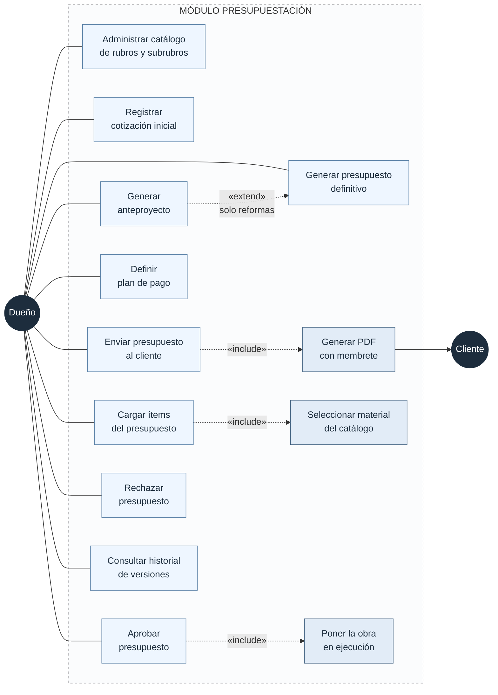
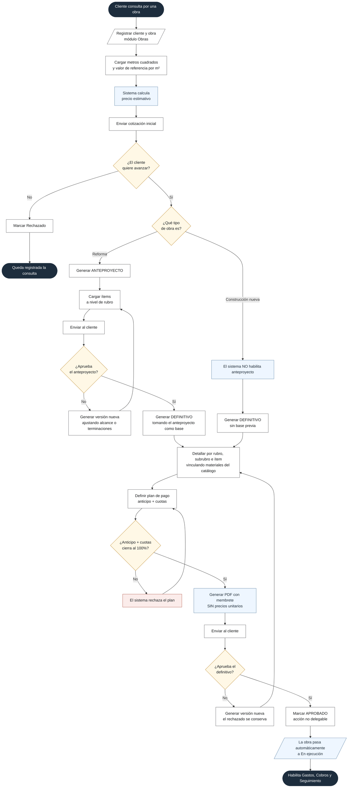
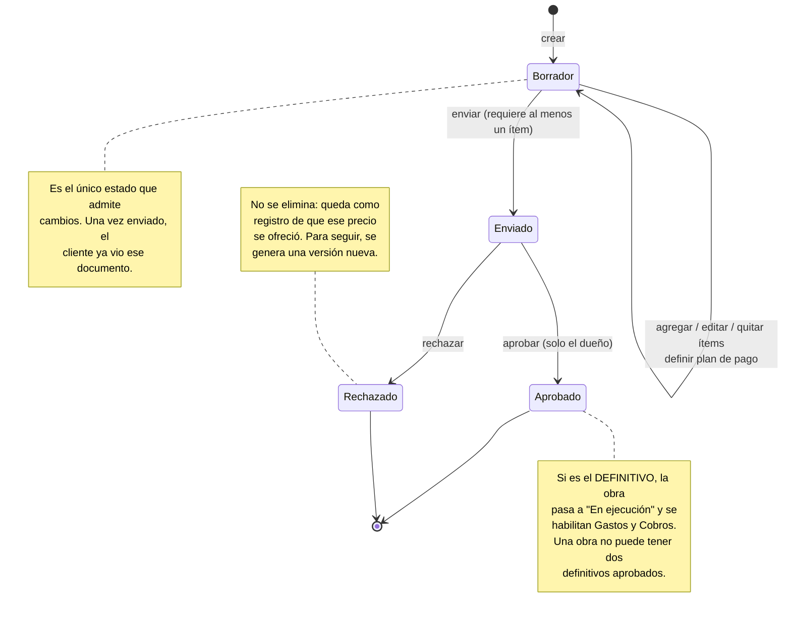
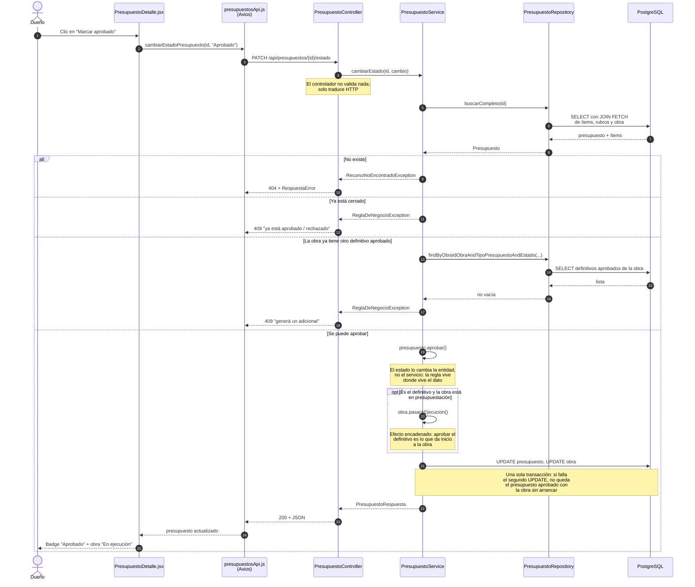
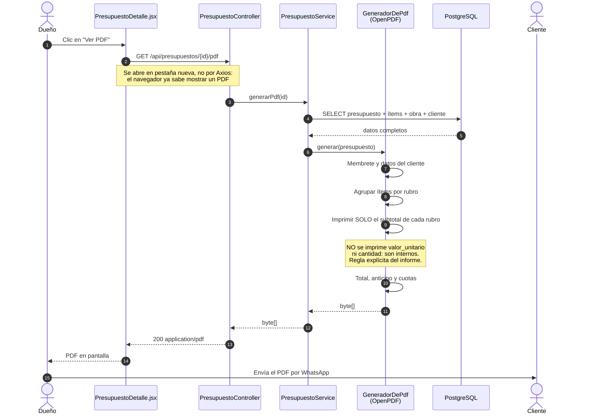

# Proceso de Presupuestación — diagramas

Presupuestación es el proceso **core** de SIGCO: es el más complejo de los 14
módulos, el que más problemas del relevamiento resuelve, y del que dependen
Gastos (para comparar) y Cobros (para el plan de cuotas).

Los diagramas de este documento describen el proceso **tal como está
implementado y funcionando**, no una intención de diseño.

> **Por qué este proceso y no otro.** El informe releva que cada presupuesto se
> arma desde cero en Excel, que las versiones se pisan entre sí y que no queda
> registro de cuál aprobó el cliente. Es el problema más costoso que identifica
> el relevamiento, y el que justifica la parte más elaborada del modelo de datos
> (la autorreferencia de `presupuesto`).

---

## 1. Diagrama de casos de uso

Quién puede hacer qué en el módulo. Los permisos salen de la matriz de roles del
informe.

### Notas sobre los actores

**El Dueño es el único actor con acceso al módulo.** No es una simplificación
del diagrama: la matriz de permisos del informe le da acceso «Total» al dueño y
«sin acceso» a los dos roles de capataz. Presupuestación maneja precios y
márgenes, que es justamente la información que la delegación no debe alcanzar.

**El Cliente es un actor externo que no opera el sistema.** Recibe el PDF y
responde por fuera (WhatsApp, teléfono). El dueño registra esa respuesta como
Aprobado o Rechazado. Modelarlo como usuario del sistema sería inventar un
requerimiento que el relevamiento no pide.

**`UC8 Aprobar` es no delegable.** El informe lo dice explícitamente, y por eso
aparece solo conectado al dueño aunque otras acciones pudieran delegarse en el
futuro.

---

## 2. Diagrama de actividad — el proceso completo

Las tres instancias del proceso, con el punto de decisión que las separa: el
tipo de obra.

### Las tres decisiones que definen el proceso

**`¿Qué tipo de obra es?`** — Es la bifurcación central. En una reforma hay que
relevar lo existente antes de poder detallar, y de ahí el anteproyecto. En una
construcción nueva se parte de planos y no hay nada que relevar, así que el
sistema directamente **no habilita** generar un anteproyecto. Esto no es una
sugerencia de la interfaz: el backend rechaza la operación con `409`.

**`¿Anticipo + cuotas cierra al 100%?`** — El plan de pago no se guarda si no
cierra matemáticamente. Es la regla que evita el error de planilla que hoy pasa
desapercibido hasta que falta plata al final de la obra.

**`¿Aprueba el definitivo?`** — Un «No» **no borra nada**. Genera una versión
nueva y el rechazado queda como registro de que ese precio se ofreció. Eso es
exactamente lo que se pierde hoy cuando la nueva versión de Excel pisa la
anterior.

---

## 3. Diagrama de estados del presupuesto

El ciclo de vida de un presupuesto y qué habilita cada transición.

**Aprobado y Rechazado son estados finales.** No hay transición de salida: un
presupuesto cerrado no vuelve a Borrador. Si hace falta cambiar algo, se genera
una versión nueva vinculada por `id_presupuesto_base`, y así queda registrado
que hubo un cambio y cuál fue.

---

## 4. Diagrama de secuencia — aprobar el presupuesto definitivo

Cómo ejecuta el sistema la operación más importante del módulo. Los componentes
son los reales, con sus nombres de archivo.

### Lo que este diagrama deja ver

**El controlador no tiene lógica.** Recibe, delega, devuelve. No hay `try/catch`:
las excepciones las traduce a códigos HTTP un manejador global
(`ManejadorGlobalDeErrores`), así que el formato de error es idéntico en los 45
endpoints del sistema.

**Las tres validaciones ocurren antes de tocar la base.** El diagrama las muestra
como ramas `alt` porque son excluyentes: la primera que falla corta.

**El cambio de estado de la obra está dentro de la misma transacción.** El método
es `@Transactional`, así que o se guardan los dos cambios o no se guarda
ninguno. Sin eso podría quedar un presupuesto aprobado con la obra todavía en
presupuestación — un estado que ningún registro justificaría.

---

## 5. Diagrama de secuencia — generar el PDF para el cliente

La segunda operación crítica, porque es la única salida del sistema que ve una
persona ajena a la empresa.

**La regla que este diagrama existe para mostrar:** el PDF imprime subtotales por
rubro, total, anticipo y cuota — nada más. Verificado sobre un presupuesto real
de 16 ítems descomprimiendo el archivo generado: aparecen exactamente 6
importes, ninguno de ellos un precio unitario.

Es la regla de negocio más delicada del módulo. Si se filtrara el valor
unitario, el cliente vería el margen sobre cada ítem.

---

## 6. Correspondencia con el código

Para poder rastrear cada diagrama hasta su implementación:

| Elemento del diagrama | Dónde está en el código |
| --- | --- |
| Circuito por tipo de obra | `PresupuestoService.validarCircuito()` |
| Versionado con base | `PresupuestoService.duplicar()` |
| Plan de pago que cierra al 100% | `PresupuestoService.definirPlanDePago()` |
| Transiciones de estado | `Presupuesto.enviar() / aprobar() / rechazar()` |
| Un solo definitivo aprobado | `PresupuestoService.exigirUnSoloDefinitivoAprobado()` |
| Obra a "En ejecución" | `PresupuestoService.aprobar()` → `Obra.pasarAEjecucion()` |
| PDF sin precios unitarios | `GeneradorDePdf` |
| Material del rubro correcto | `PresupuestoService.resolverMaterial()` |

Cada uno tiene tests en `PresupuestoServiceTest` (45 casos).
